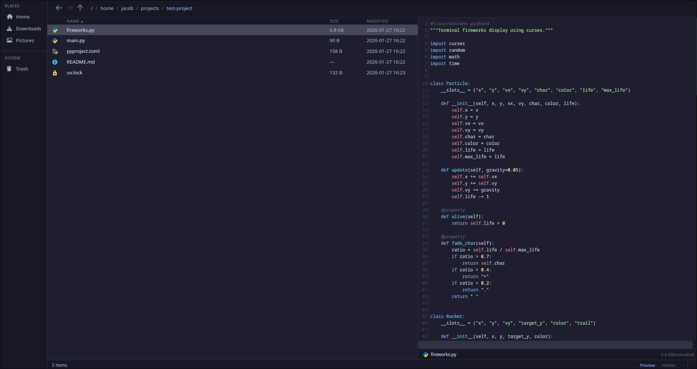

# pane-fm

A themeable file manager for Hyprland. Built with Tauri, Svelte, and Rust.

[](https://aur.archlinux.org/packages/pane-fm-git)
[](LICENSE)

GTK file managers are held hostage by libadwaita's anti-theming philosophy. pane-fm is a from-scratch file manager that you actually control the look of — just CSS.

Heavily inspired by [yazi](https://github.com/sxyazi/yazi), which is incredible — if you want a terminal file manager, use yazi. pane-fm exists for people who want something between a traditional GUI file manager and a terminal-based one: vim keybinds and keyboard-first navigation, but with a visual preview panel, drag and drop, and a right-click menu.

Is building a file manager on a webview a good idea? Probably not. But here we are, and it's actually pretty fast.



## Install

**Arch Linux (AUR):**

```bash
yay -S pane-fm-git
```

**From source:**

```bash
git clone https://github.com/jakeb-grant/pane-fm.git
cd pane-fm
bun install
bun run sync-icons
bun run tauri build
# Binary at src-tauri/target/release/pane-fm
```

Requires: [Rust](https://rustup.rs/), [Bun](https://bun.sh/), `webkit2gtk-4.1`

## Features

**Navigation**
- Yazi-inspired keyboard navigation (vim keys, chords, visual mode)
- Tabs with vim-style switching (`gt`/`gT`, `1`-`9`) and session restore
- Back/forward/up navigation with history
- Fuzzy filter and recursive file search
- Command palette (`Ctrl+Shift+P`)

**File Operations**
- Create, rename, copy, move, delete with progress and cancellation
- Trash support (freedesktop spec)
- Compress/extract archives (zip, tar.gz, tar.xz, tar.zst, tar.bz2)
- Drag and drop (internal + cross-app)
- Multi-select (Space, visual mode, Ctrl+A, Shift+click)
- `$EDITOR` integration for text files

**Preview**
- Syntax-highlighted text preview (Web Worker, non-blocking)
- Image thumbnails, PDF preview, directory listing
- LRU cache with adjacent entry prefetch for instant navigation

**Customization**
- CSS theme system with hot-reload
- 3 bundled themes: Catppuccin Mocha, Nord, Dark Minimal
- Configurable keybinds via `~/.config/pane-fm/config.toml`
- Custom right-click actions (shell commands with placeholders)
- ~1,100 Material Icon Theme SVGs with light/dark mode

**System Integration**
- Sidebar with XDG bookmarks and mounted/unmounted drives
- Click-to-mount via udisks2
- "Open With" reads `.desktop` files
- Filesystem watching (live directory updates)
- MIME detection (extension + magic bytes)
- Responsive layout adapts to window width

## Theming

Themes are plain CSS files that override `:root` variables. No special format, no build step.

```toml
# ~/.config/pane-fm/config.toml
[general]
theme = "nord"
```

Three starter themes are installed to `~/.config/pane-fm/themes/` on first launch. Create your own by copying one and editing the CSS variables:

```css
:root {
    --bg-primary: #1a1a2e;
    --bg-secondary: #16213e;
    --text-primary: #e0e0e0;
    --accent: #e94560;
    /* ... see full list below */
}
```

Theme files are watched at runtime — edits apply instantly.

<details>
<summary>All theme properties</summary>

| Property | Default | Description |
|----------|---------|-------------|
| `--bg-primary` | `#1e1e2e` | Main background |
| `--bg-secondary` | `#181825` | Sidebar, toolbar, dialog backgrounds |
| `--bg-surface` | `#313244` | Hover/selected row, input backgrounds |
| `--bg-hover` | `#45475a` | Hover state |
| `--text-primary` | `#cdd6f4` | Main text |
| `--text-secondary` | `#a6adc8` | Secondary text |
| `--text-muted` | `#6c7086` | Labels, hints |
| `--accent` | `#89b4fa` | Accent color |
| `--accent-hover` | `#74c7ec` | Accent hover state |
| `--border` | `#313244` | Borders and dividers |
| `--danger` | `#f38ba8` | Delete, error states |
| `--success` | `#a6e3a1` | Success states |
| `--warning` | `#f9e2af` | Warning states |
| `--radius` | `6px` | Border radius |
| `--overlay-bg` | `rgba(0,0,0,0.5)` | Dialog overlay backdrop |
| `--shadow-sm` | `0 4px 12px rgba(0,0,0,0.3)` | Small shadow (menus) |
| `--shadow-lg` | `0 8px 32px rgba(0,0,0,0.4)` | Large shadow (dialogs) |
| `--scrollbar-width` | `8px` | Scrollbar width |
| `--transition-fast` | `0.1s` | Fast transitions |
| `--transition-normal` | `0.15s` | Normal transitions |
| `--font-mono` | JetBrains Mono Nerd Font, ... | Monospace / icon font |
| `--font-sans` | Inter, sans-serif | UI font |

</details>

## Custom Actions

Add shell commands to the right-click menu:

```toml
[[actions]]
name = "Edit in Neovim"
command = "ghostty -e nvim %f"
context = "file"

[[actions]]
name = "Set as Wallpaper"
command = "hyprctl hyprpaper wallpaper eDP-1,%f"
context = "file"
mime = "image/*"

[[actions]]
name = "Make Executable"
command = "chmod +x %f"
context = "file"
refresh = true
```

<details>
<summary>Action fields and placeholders</summary>

| Field | Required | Default | Description |
|-------|----------|---------|-------------|
| `name` | yes | -- | Label shown in the context menu |
| `command` | yes | -- | Shell command with placeholders |
| `context` | no | `"any"` | When to show: `"file"`, `"directory"`, `"any"`, `"background"` |
| `mime` | no | -- | MIME filter (e.g. `"image/*"`, `"text/plain"`) |
| `refresh` | no | `false` | Refresh directory listing after command completes |

| Placeholder | Description |
|-------------|-------------|
| `%f` | Full path of the focused file/directory |
| `%n` | Filename without extension |
| `%F` | All selected file paths (space-separated) |
| `%d` | Current directory path |

</details>

## Stack

| Layer | Technology |
|-------|------------|
| Backend | Rust (Tauri v2) |
| Frontend | Svelte 5 + TypeScript |
| Rendering | WebKitGTK (webview, not GTK widgets) |
| Package manager | Bun |
| Lint/format | Biome + Clippy |

<details>
<summary>Architecture</summary>

```
src/                              # Frontend (Svelte 5)
├── routes/+page.svelte           # Layout shell + keybind wiring
├── lib/
│   ├── stores/
│   │   ├── fileManager.svelte.ts # Navigation, file, selection, clipboard state
│   │   ├── tabs.svelte.ts        # Tab management
│   │   └── dialogs.svelte.ts     # Dialog/busy/progress state + orchestration
│   ├── keybinds.ts               # Keybind/chord definitions + config overrides
│   ├── commandRegistry.ts        # Command list for palette + help dialog
│   ├── fileOps.ts                # File operation handlers
│   ├── contextMenu.ts            # Context menu item builders
│   ├── commands.ts               # Tauri IPC wrappers
│   ├── errors.ts                 # Structured error types + helpers
│   ├── constants.ts              # Shared constants + text/image/PDF detection
│   ├── highlight.ts              # Syntax highlighting (highlight.js language maps)
│   ├── highlightWorker.ts        # Web Worker for non-blocking syntax highlighting
│   ├── previewCache.ts           # LRU preview cache (5MB, mtime-validated)
│   ├── transitions.ts            # Shared transition functions (fade, pop, fly)
│   ├── icons.ts                  # Material Icon Theme SVG lookup
│   ├── icons.gen.ts              # Generated icon maps (from sync-icons script)
│   ├── utils.ts                  # Path/format helpers
│   └── components/               # Presentational components

src-tauri/src/                    # Backend (Rust)
├── lib.rs                        # Tauri builder + command registration
├── config.rs                     # TOML config loading + default config generation
├── error.rs                      # AppError enum (structured errors)
├── progress.rs                   # Shared progress emission + cancellation
├── fs_ops.rs                     # FileEntry/DriveEntry models, read_directory, MIME, file ops
└── commands/
    ├── config.rs                 # get_config + watch_config commands
    ├── file_ops.rs               # Directory listing, create/rename/copy/move/delete, properties
    ├── archive.rs                # Compress/extract with progress + cancellation
    ├── apps.rs                   # Open files, .desktop file parsing, Open With
    ├── search.rs                 # Recursive file search with streaming results
    ├── trash.rs                  # Freedesktop trash list/restore/empty
    ├── drives.rs                 # Drive detection (lsblk) + mount (udisksctl)
    ├── watcher.rs                # Filesystem watching for live directory updates
    └── theme.rs                  # Theme loading, file watching, default theme installation
```

</details>

## Development

```bash
bun install
bun run sync-icons   # generate Material Icon Theme SVGs (first time only)
bun run tauri dev
```

```bash
# Checks
cargo check --manifest-path src-tauri/Cargo.toml
cargo clippy --manifest-path src-tauri/Cargo.toml
cargo test --manifest-path src-tauri/Cargo.toml
bunx svelte-check --tsconfig ./tsconfig.json
bunx biome check --write
```

## Roadmap

See [ROADMAP.md](ROADMAP.md) for planned features.

## License

MIT
